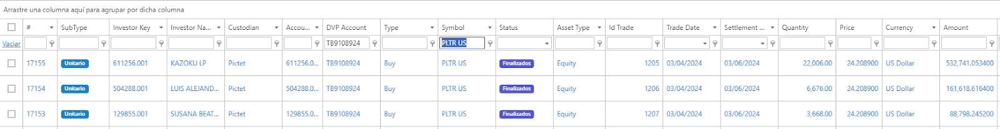
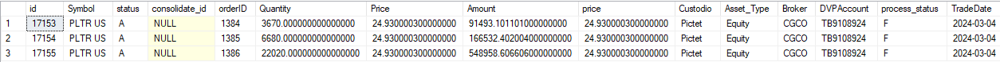

# Activar confirmaciones en OMS Compass de las órdenes consolidadas en Broker

Hay órdenes consolidadas en Broker que no se les crea confirmaciones en Ria.
Además, al momento de crear las confirmaciones para las hijas, no toma el precio de la confirmación de la hija.
A continuación un ejemplo de ello:

Detalle de las órdenes en OMS Compass
(Consulta Confirmaciones)

(Información de orden)

   

En OMS Broker:
(Consulta Confirmaciones)
  

(Información de orden)

## Configuración
El sistema cuando envía las confirmaciones órdenes consolidadas pasa por una condicional, la cual establece de que si el custodio (consultado en la tabla de instituciones) posee el campo “Send Custodian Order to OMS Broker” en False, no enviará las confirmaciones a RIA.

Este ajuste se encuentra en la gran mayoría de casos en False en Compass Broker, lo cual evita que la órdenes consolidadas de custodios con este ajuste en False no se repliquen en Compass.

Al activar este campo en el custodio que sea necesario, el sistema enviará efectivamente las confirmaciones desde Broker a Compass RIA de órdenes consolidadas.

### Equity

Se activa el campo Send Custodian Order to OMS Broker en Pictet en Compass Broker:
